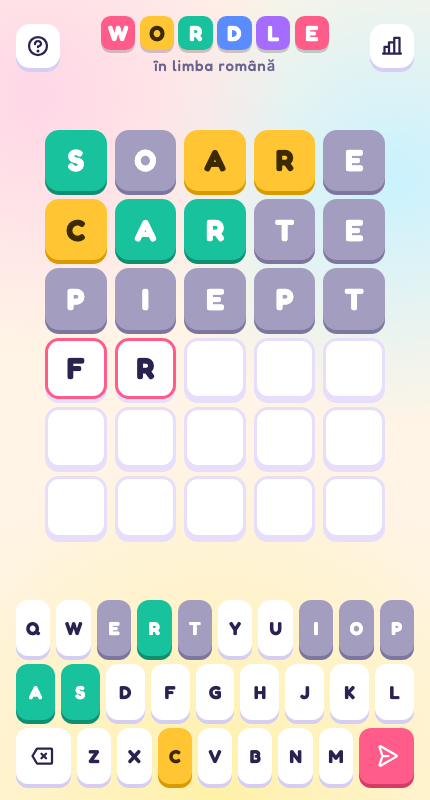

<div align="center">

# 🟩 Wordle în română

**Ghicește cuvântul de 5 litere din 6 încercări: a playful Romanian take on Wordle, made for phones and desktop.**




</div>

---

## About

Wordle în română is the classic five-letter word game with a Romanian word list. Each game picks a random word, and every guess colors its letters to show how close you are. It's built with React and TypeScript, with all the game rules in one pure reducer. There's no backend: your stats live in the browser.

## Features

- 🇷🇴 **Romanian words:** about 1,500 five-letter words, checked against [DEXonline](https://dexonline.ro/)'s base-form list. Diacritics don't count, so Ă and  are typed as A, Î as I, Ș as S and Ț as T.
- 🎯 **Proper scoring for repeated letters:** a letter turns yellow only as many times as it's still unmatched in the answer.
- 🎨 **Playful design:** chunky 3D tiles and keys, a pastel background and the Fredoka font, with light and dark themes that follow your system.
- ✨ **Animations:** tiles pop as you type and flip one by one when you submit. The row shakes on an invalid word and the winning row bounces. All motion turns off when your system's "reduce motion" setting is on.
- 📊 **Stats saved locally:** games played, win rate, current and best streak, and a chart of how many guesses each win took, stored in `localStorage`.
- ❓ **How to play:** first-time players see the rules with a colored example for each tile color.
- 📱 **Installable:** a web app manifest and icons let you add it to your home screen.

## Controls

| Action           | Keys                        |
| ---------------- | --------------------------- |
| Type a letter    | `A`–`Z`                     |
| Delete a letter  | `Backspace`                 |
| Submit the guess | `Enter`                     |
| Close a panel    | `Esc`, or click outside it  |

The on-screen keyboard works the same way, with ⌫ to delete and the send button to submit. Keys take the color of the best result each letter has had so far.

## Getting started

Requires [Node.js](https://nodejs.org/) 20.19+ or 22.12+, and [pnpm](https://pnpm.io/).

```sh
git clone git@github.com:Graidenix/wordle-ro.git
cd wordle-ro
pnpm install
pnpm dev
```

Open the URL Vite prints and start guessing, or play it live at **[wordle.odajiu.eu](https://wordle.odajiu.eu/)**.

### Scripts

| Command          | What it does                          |
| ---------------- | ------------------------------------- |
| `pnpm dev`       | Start the dev server with hot reload  |
| `pnpm build`     | Type-check, then build to `dist/`     |
| `pnpm preview`   | Serve the production build locally    |
| `pnpm typecheck` | Run `tsc` without emitting            |
| `pnpm lint`      | Lint with ESLint + typescript-eslint  |

## Project structure

```
src/
├── main.tsx         # entry: mounts the app
├── App.tsx          # error boundary + stats and game providers
├── components/      # Board, Row, Tile, Keyboard, Key, Header, modals, Toast
├── contexts/        # GameContext (reducer) and StatsContext (localStorage)
├── hooks/           # physical keyboard input, recording finished games
├── utils/           # game reducer, scoring, board/keyboard builders, storage
├── data/words.ts    # the word list
├── types/game.ts    # shared types
└── styles/          # SCSS partials: tokens, animations, board, keyboard, overlays
public/              # favicon, app icons, manifest, link-preview image
```

## How it works

- **Pure reducer:** every rule (typing, deleting, validating and scoring a guess, winning, losing, starting over) lives in `utils/gameReducer.ts`. A new game's answer is passed in with the action, so the reducer stays pure and easy to test.
- **Derived UI:** the board rows and keyboard colors are computed from the list of guesses on each render, never stored separately, so they can't fall out of sync.
- **Split contexts:** game state and dispatch, and stats and their actions, sit in separate React contexts, so components that only send actions don't re-render when the state changes.
- **CSS-driven animation:** tiles are styled by a `data-state` attribute. The flip swaps colors at its halfway point, and the keyboard and result screen wait until the flip finishes, so they don't give the answer away early.

## Credits

Wordle was created by Josh Wardle and is now owned by The New York Times. This is a non-commercial fan version made for learning and fun.

The word list was checked against the [DEXonline](https://dexonline.ro/scrabble) Scrabble word list. Icons are from [Phosphor](https://phosphoricons.com/), and the font is [Fredoka](https://fonts.google.com/specimen/Fredoka).
